# CLIProxyAPI Request Lifecycle — Full Detail

Pinned to upstream **v7.2.88** (`github.com/router-for-me/CLIProxyAPI/v7`). All line numbers below
refer to the vendored-source snapshot this plugin-authoring skill set was built from.

## 1. Client-facing entry points

Routes are registered in `internal/api/server.go`, `setupRoutes()`:

```go
v1.GET("/models", s.unifiedModelsHandler(openaiHandlers, claudeCodeHandlers))
v1.POST("/chat/completions", openaiHandlers.ChatCompletions)
v1.POST("/completions", openaiHandlers.Completions)
v1.POST("/images/generations", openaiHandlers.ImagesGenerations)
v1.POST("/images/edits", openaiHandlers.ImagesEdits)
v1.POST("/videos", openaiHandlers.XAIVideosGenerations)
v1.POST("/messages", claudeCodeHandlers.ClaudeMessages)
v1.POST("/messages/count_tokens", claudeCodeHandlers.ClaudeCountTokens)
v1.GET("/responses", openaiResponsesHandlers.ResponsesWebsocket)
v1.POST("/responses", openaiResponsesHandlers.Responses)
v1.POST("/responses/compact", openaiResponsesHandlers.Compact)
v1beta.GET("/models", s.geminiModelsHandler(geminiHandlers))
v1beta.POST("/interactions", geminiHandlers.Interactions)
v1beta.POST("/models/*action", geminiHandlers.GeminiHandler)
v1beta.GET("/models/*action", s.geminiGetHandler(geminiHandlers))
```

The **entry protocol** ("SourceFormat"/"handlerType") is one of the `sdktranslator.Format`
constants declared in `sdk/translator/builtin/builtin.go`:

```go
const (
    FormatOpenAI         Format = "openai"
    FormatOpenAIResponse Format = "openai-response"
    FormatClaude         Format = "claude"
    FormatGemini         Format = "gemini"
    FormatCodex          Format = "codex"
    FormatAntigravity    Format = "antigravity"
    FormatInteractions   Format = "interactions"
)
```

Each protocol-specific Gin handler (`sdk/api/handlers/{openai,gemini,claude}/`) parses the client
request just enough to extract `modelName`/`alt`/streaming flag, then delegates to the shared,
protocol-agnostic execution core in `sdk/api/handlers/handlers.go`.

## 2. The execution core: `sdk/api/handlers/handlers.go`

`BaseAPIHandler` is the single choke point every request flows through, and is where nearly all
plugin hooks are actually invoked (as opposed to merely declared). Key entry functions:

- `ExecuteWithAuthManager` / `executeWithAuthManagerFormats` — non-streaming
- `ExecuteStreamWithAuthManager` / `executeStreamWithAuthManagerFormats` — streaming
- `ExecuteCountWithAuthManager` / `executeCountWithAuthManager` — token counting

### 2.1 Non-streaming path, in call order

```go
func (h *BaseAPIHandler) executeWithAuthManagerFormats(ctx context.Context, entryProtocol, exitProtocol, modelName string, rawJSON []byte, alt string, allowImageModel bool, execOptions modelExecutionOptions) ([]byte, http.Header, *interfaces.ErrorMessage) {
    originalRequestedModel := modelName
    routeDecision := h.applyModelRouter(ctx, entryProtocol, modelName, rawJSON, false, execOptions)      // (1) MODEL ROUTER
    responseProtocol := modelExecutionResponseProtocol(entryProtocol, exitProtocol)
    ...
    if routeDecision.ExecutorPluginID != "" {
        return h.executeWithPluginExecutor(...)                                                          // short-circuit straight to a plugin executor
    }
    providers, normalizedModel, errMsg := h.providersForExecution(...)                                    // resolve built-in provider candidates + canonical model name
    ...
    req := coreexecutor.Request{Model: normalizedModel, Payload: payload}
    opts := coreexecutor.Options{
        Stream: false, ...,
        SourceFormat:                sdktranslator.FromString(entryProtocol),
        ResponseFormat:              sdktranslator.FromString(responseProtocol),
        RequestAfterAuthInterceptor: h.requestAfterAuthInterceptor(afterAuthCapture, execOptions.SkipInterceptorPluginID), // registers (3)
    }
    req, opts = h.applyRequestInterceptorsBeforeAuth(ctx, entryProtocol, originalRequestedModel, req, opts, ...)  // (2) REQUEST INTERCEPTOR — before auth
    resp, err := h.AuthManager.Execute(ctx, providers, req, opts)                                          // (3)+(4)+(5) — scheduler, after-auth interceptor, translate, executor call, translate-back — all inside Manager.Execute
    ...
    body, responseHeaders := h.applyResponseInterceptors(ctx, ..., resp.Payload, http.StatusOK, ...)       // (6) RESPONSE INTERCEPTOR
    return body, responseHeaders, nil
}
```

### 2.2 Inside `h.AuthManager.Execute(...)` (`sdk/cliproxy/auth/conductor.go`)

`Manager.Execute` normalizes providers, then loops calling `executeMixedOnce` with retry/cooldown
around auth-selection failures (`shouldRetryAfterError`, `waitForCooldown`). Inside one attempt:

1. **Auth/credential selection ("scheduler")** — `pickNextMixed`/`pickNext` choose a
   provider+auth pair. Two sub-paths:
   - `pickViaPluginScheduler` calls `scheduler.PickAuth(ctx, req)` — the plugin `Scheduler.Pick`
     capability, reached via the `PluginScheduler` interface which
     `internal/pluginhost/scheduler.go`'s `Host.PickAuth` implements. The plugin can either return
     a specific `AuthID` or `DelegateBuiltin` (`"round-robin"` or `"fill-first"`, constants
     `pluginapi.SchedulerBuiltinRoundRobin`/`SchedulerBuiltinFillFirst`) to fall through to the
     built-in strategy.
   - `pickViaBuiltinScheduler` — the native round-robin/fill-first implementation, used when no
     scheduler plugin is registered or it delegates.
   - Manager wiring: `sdk/cliproxy/service.go` — `s.coreManager.SetPluginScheduler(s.pluginHost)`.
2. **Request-after-auth interceptor** — `applyRequestAfterAuthInterceptor` invokes the
   `RequestAfterAuthInterceptor` callback set on `opts` in §2.1 — the plugin
   `RequestInterceptor.InterceptRequestAfterAuth` capability, now with the concrete selected
   `ToFormat`/`Model` known (post credential selection, pre executor-level translation).
3. **Executor dispatch** — `executor.Execute(ctx, auth, execReq, execOpts)` (or `ExecuteStream`) is
   called on whichever `ProviderExecutor` was resolved for that provider — either a **built-in
   executor** (`internal/runtime/executor/*.go`) or a **plugin executor adapter**
   (`internal/pluginhost/adapters.go` `executorAdapter.Execute`, wrapping the plugin's
   `Executor.Execute` RPC capability).

### 2.3 Inside a built-in provider executor (e.g. `internal/runtime/executor/gemini_executor.go`)

Each built-in executor performs, per call:

1. Translate the canonical/entry-format request into the provider's wire format via the
   `sdktranslator` **Pipeline**/**Registry** (`FromFormat` = entry format, `ToFormat` = provider
   format, e.g. `"gemini"`, `"codex"`, `"claude"`).
2. Apply the **canonical thinking pipeline** — every built-in executor has the identical call
   shape: `thinking.ApplyThinking(body, req.Model, from.String(), to.String(), e.Identifier())`
   (`claude_executor.go`, `codex_executor.go`, `codex_websockets_executor.go`, `xai_executor.go`,
   `kimi_executor.go`, `aistudio_executor.go`, `gemini_vertex_executor.go`,
   `openai_compat_executor.go`, `antigravity_executor.go`, `codex_openai_images.go` — 25 call
   sites total across these files).
3. Perform the actual upstream HTTP call.
4. Translate the provider's raw response back to the response/entry format, again via
   `sdktranslator`.

### 2.4 Where the translator plugin hooks actually fire (global, not executor-specific)

This is the subtlety a plugin author must understand: **`RequestNormalizer`, `RequestTranslator`,
`ResponseBeforeTranslator`, `ResponseTranslator`, and `ResponseAfterTranslator` are not
executor-scoped — they are wired into the single shared, process-global `sdktranslator`
registry**, so they run for *every* translation in the process, including translations performed
by built-in provider executors, not just plugin executors.

Wiring: `sdk/cliproxy/service.go` —
```go
sdktranslator.SetPluginHooks(s.pluginHost)
```
(unset with `sdktranslator.SetPluginHooks(nil)` during shutdown). `s.pluginHost`
(`*internal/pluginhost.Host`) implements the `sdktranslator.PluginHooks` interface
(`sdk/translator/plugin_hooks.go`):

```go
type PluginHooks interface {
    NormalizeRequest(ctx context.Context, from, to Format, model string, body []byte, stream bool) []byte
    TranslateRequest(ctx context.Context, from, to Format, model string, body []byte, stream bool) ([]byte, bool)
    NormalizeResponseBefore(ctx context.Context, from, to Format, model string, originalRequestRawJSON, requestRawJSON, body []byte, stream bool) []byte
    TranslateResponse(ctx context.Context, from, to Format, model string, originalRequestRawJSON, requestRawJSON, body []byte, stream bool) ([]byte, bool)
    NormalizeResponseAfter(ctx context.Context, from, to Format, model string, originalRequestRawJSON, requestRawJSON, body []byte, stream bool) []byte
}
```

`sdk/translator/registry.go`'s `TranslateRequest` shows the exact ordering: the registered
request transform function runs first if one exists (a built-in `Register(from, to, ...)` call, or
the fallback that only patches the `"model"` field); **then** `hooks.NormalizeRequest` always
runs, and `hooks.TranslateRequest` (the actual override) runs **only if no built-in transform
function (`fn`) was registered** for that `from→to` pair — i.e. `RequestTranslator` is a
fallback/gap-filler for missing routes, while `RequestNormalizer` is an always-on post-pass. The
response side mirrors this with `NormalizeResponseBefore` → built-in transform (if any) →
`TranslateResponse` (fallback) → `NormalizeResponseAfter` (always-on).

### 2.5 Response delivery back to the client

Non-streaming: `applyResponseInterceptors` builds a `pluginapi.ResponseInterceptRequest{SourceFormat,
Model, RequestedModel, RequestHeaders, ResponseHeaders, OriginalRequest, RequestBody, Body,
StatusCode, Metadata}` and calls `host.InterceptResponse` (routes to plugin
`ResponseInterceptor.InterceptResponse`).

Streaming: each chunk goes through `interceptStreamChunk` → `host.InterceptStreamChunk` (plugin
`StreamChunkInterceptor.InterceptStreamChunk`). Per `sdk/pluginapi/types.go`, the interceptor sees
a **bounded history** (`HistoryChunks`, capped at 64 chunks / 1 MiB total — constants
`maxStreamInterceptorHistoryChunks = 64`, `maxStreamInterceptorHistoryBytes = 1 << 20` in
`handlers.go`), a `ChunkIndex` (0-based; `StreamChunkHeaderInitIndex = -1` marks a header-only
priming call before the first real chunk), and can set `DropChunk: true` to suppress delivery of
that chunk while still updating interceptor-chain header state.

### 2.6 Usage accounting

After execution completes (success or failure), a `pluginapi.UsageRecord` (`Provider`, `Model`,
`AuthID`, token `UsageDetail{InputTokens, OutputTokens, ReasoningTokens, CachedTokens, ...}`,
`Latency`, `TTFT`, `Failed`/`Failure`) is handed to every registered `UsagePlugin` via
`HandleUsage`. Call sites:
- `internal/pluginhost/adapters.go` — `usageAdapter.HandleUsage` (the plugin-facing wrapper)
- `sdk/cliproxy/usage/manager.go` — `plugin.HandleUsage(ctx, record)` (the manager that fans out
  to all registered plugins; wired via `s.RegisterUsagePlugin` → `usage.RegisterPlugin(plugin)` in
  `sdk/cliproxy/service.go`)

## 3. Model routing (`ModelRouter`) — the earliest hook

`applyModelRouter` runs **before provider/model normalization and before auth selection** — it is
the very first plugin hook to see a request. It builds a `pluginapi.ModelRouteRequest{SourceFormat,
RequestedModel, Stream, Headers, Query, Body, Metadata, AvailableProviders}` and calls
`host.RouteModel` → `internal/pluginhost/model_router.go`'s `Host.RouteModel`/`RouteModelExcept`,
which iterates active plugins with a non-nil `ModelRouter` capability and calls
`router.RouteModel(ctx, req)`.

A router's `ModelRouteResponse` sets `Handled: true` plus a `TargetKind`:
- `pluginapi.ModelRouteTargetSelf` — route to the router plugin's own `Executor` capability
- `pluginapi.ModelRouteTargetExecutor` — route to a **different** named plugin's executor
  (`Target` = plugin ID)
- `pluginapi.ModelRouteTargetProvider` — route through the **built-in** auth/executor path for a
  named built-in provider (`Target` = provider key, optionally `TargetModel` to rewrite the model)

`model_router.go` validates the target before honoring it: for `TargetProvider` it checks
`h.HasBuiltinProvider(resp.Target)` (must currently have registered auth); for `Self`/`Executor` it
checks `h.executorPluginReady(...)` (`executor_route.go`) which verifies the target plugin
declares an `Executor`, allows static execution, resolves a provider identifier, and that its
declared `ExecutorInputFormats`/`ExecutorOutputFormats` are actually compatible with the current
request's formats — an invalid/unready target is treated as **unhandled**, so routing falls
through to the next lower-priority router rather than committing to a target that would 500 later.

## 4. Thinking / reasoning pipeline and the `ThinkingApplier` hook

`internal/thinking/apply.go`: *"Main thinking/reasoning pipeline. `ApplyThinking()` (`apply.go`)
parses suffixes (`suffix.go`, suffix overrides body), normalizes config to canonical
`ThinkingConfig` (`types.go`), normalizes and validates centrally (`validate.go`/`convert.go`),
then applies provider-specific output via `ProviderApplier`. Do not break this 'canonical
representation → per-provider translation' architecture."*

```go
var nativeProviderAppliers = map[string]ProviderApplier{
    "gemini": nil, "claude": nil, "openai": nil, "codex": nil,
    "antigravity": nil, "kimi": nil, "xai": nil,
}
var pluginProviderAppliers = map[string]pluginProviderApplier{}
func GetProviderApplier(provider string) ProviderApplier { ... checks native map first, then pluginProviderAppliers ... }
func RegisterProvider(name string, applier ProviderApplier) { ... }
```

Plugin wiring: `internal/pluginhost/adapters.go` has a `thinkingAdapter` (`Apply`) that calls the
plugin's `ThinkingApplier.ApplyThinking(ctx, pluginapi.ThinkingApplyRequest{Provider, Model,
Config, Body})`, and `Host.refreshThinkingProviders`/`callThinkingIdentifier` register a plugin's
declared provider key into `pluginProviderAppliers` at plugin-load time (using the plugin's
`ThinkingApplier.Identifier()`). So a plugin can **own thinking-application for its own provider
key** but cannot override a native provider's thinking behavior (native keys are seeded non-nil
once a real applier registers, and lookup order is native-map-first).

All 25+ built-in executor call sites use the identical shape
`thinking.ApplyThinking(body, req.Model, from.String(), to.String(), e.Identifier())`.

## 5. Model registry

`internal/registry/model_registry.go` (`ModelRegistry`, `RegisterClient(clientID, clientProvider
string, models []*ModelInfo)`) backs `/v1/models` and `/v1beta/models`. The SDK-facing wrapper is
`sdk/cliproxy/model_registry.go`:
```go
type ModelRegistry interface { ... }
func GlobalModelRegistry() ModelRegistry
```
Plugin wiring happens through two capabilities:
- `ModelRegistrar.RegisterModels` — plugin contributes static, development-time model metadata
  (`Host.RegisterModels`, `adapters.go`).
- `ModelProvider.StaticModels` / `ModelProvider.ModelsForAuth` — provider-native static models and
  per-auth (OAuth-discovered) models (`adapters.go`).

`internal/registry/model_updater.go`'s `StartModelsUpdater` refreshes remote model lists
automatically; `--local-model` disables this.

## 6. Reliability notes relevant to plugin authors

- **Fusing**: `internal/pluginhost/adapters.go` / `host.go` wrap every plugin capability call in a
  `recover()` that calls `h.fusePlugin(id, "<Capability>.<Method>", recovered)` on panic (see
  `model_router.go:callModelRouter`, `scheduler.go:callScheduler`). A fused plugin is skipped for
  the rest of that snapshot's lifetime — **a panicking plugin hook degrades gracefully to
  "unhandled" rather than crashing the host**, but only for that one plugin's remaining calls.
- **Hot reload**: `internal/pluginhost/snapshot.go` holds an atomic `Snapshot` of active plugin
  records; config/plugin binary changes are picked up by `internal/watcher/` without a process
  restart.
- **Metadata is a read-only clone**: several request types (`ModelRouteRequest.Metadata`,
  `RequestInterceptRequest.Metadata`, `StreamChunkInterceptRequest.Metadata`) are documented as "a
  best-effort cloned context snapshot. Treat it as read-only and JSON-like" — mutating it in a
  plugin has no effect on the host's real request state.
- **Except-variants**: nearly every host dispatch method has a `...Except(ctx, req,
  skipPluginID string)` sibling (`InterceptRequestBeforeAuthExcept`, `RouteModelExcept`, etc.) —
  used so that when a `ModelRouter` plugin routes a request to *itself*, the interceptor chain
  that subsequently runs doesn't re-invoke that same plugin's own interceptor capability
  recursively.

## 7. Pipeline diagram

```mermaid
flowchart TD
    A["Client request\nHTTP: /v1/chat/completions, /v1/messages,\n/v1beta/models/*, /v1/responses ..."] --> B["Gin route\ninternal/api/server.go setupRoutes()"]
    B --> C["Protocol handler\nsdk/api/handlers/{openai,claude,gemini}\ne.g. ChatCompletions / ClaudeMessages / GeminiHandler"]
    C --> D{{"FrontendAuthProvider\n(inbound API-key/auth check,\ninternal/access + plugin bridge)"}}
    D --> E["BaseAPIHandler.execute*WithAuthManagerFormats\nsdk/api/handlers/handlers.go"]

    E --> F{{"HOOK: ModelRouter\napplyModelRouter → host.RouteModel\n(pluginapi.ModelRouter)"}}
    F -->|"TargetKind=provider/self/executor"| G["Plugin executor route\n(executeWithPluginExecutor)"]
    F -->|"unhandled"| H["providersForExecution\n(resolve built-in providers + normalized model,\ninternal/registry)"]

    H --> I{{"HOOK: RequestInterceptor.InterceptRequestBeforeAuth\napplyRequestInterceptorsBeforeAuth\n(pluginapi.RequestInterceptor)"}}
    I --> J["AuthManager.Execute\nsdk/cliproxy/auth/conductor.go"]

    subgraph J1 [" AuthManager.Execute (conductor.go) "]
        direction TB
        K{{"HOOK: Scheduler.Pick\npickViaPluginScheduler → host.PickAuth\n(pluginapi.Scheduler)\n(falls back to built-in round-robin/fill-first)"}}
        K --> L{{"HOOK: RequestInterceptor.InterceptRequestAfterAuth\napplyRequestAfterAuthInterceptor\n(pluginapi.RequestInterceptor, post credential-selection)"}}
        L --> M["executor.Execute / ExecuteStream\n(ProviderExecutor)"]
    end
    J --> J1

    M --> N1["Built-in executor\ninternal/runtime/executor/*.go\n(gemini/claude/codex/antigravity/xai/kimi/openai_compat)"]
    M --> N2["Plugin executor adapter\ninternal/pluginhost/adapters.go executorAdapter\n(pluginapi.ProviderExecutor RPC)"]

    N1 --> O1{{"sdktranslator.Pipeline.TranslateRequest\nFromFormat=entry, ToFormat=provider"}}
    O1 --> P1["Global translator plugin hooks\n(always run, process-wide):\nHOOK: RequestNormalizer.NormalizeRequest (always)\nHOOK: RequestTranslator.TranslateRequest (fallback if no built-in fn)"]
    P1 --> Q1{{"HOOK: ThinkingApplier.ApplyThinking\ninternal/thinking.ApplyThinking\n(native map first, else pluginProviderAppliers)"}}
    Q1 --> R1["Upstream HTTP call\n(provider API)"]
    R1 --> S1{{"sdktranslator.Pipeline.TranslateResponse\nFromFormat=provider, ToFormat=response"}}
    S1 --> T1["Global translator plugin hooks:\nHOOK: ResponseBeforeTranslator.NormalizeResponse (before)\nHOOK: ResponseTranslator.TranslateResponse (fallback)\nHOOK: ResponseAfterTranslator.NormalizeResponse (after, always)"]

    N2 --> T1
    T1 --> U["Response back in AuthManager\n(usage MarkResult, retry/cooldown bookkeeping)"]
    U --> V{{"HOOK: ResponseInterceptor.InterceptResponse (non-stream)\nOR StreamChunkInterceptor.InterceptStreamChunk (per SSE chunk,\nbounded HistoryChunks, DropChunk support)"}}
    V --> W{{"HOOK: UsagePlugin.HandleUsage\nsdk/cliproxy/usage/manager.go +\ninternal/pluginhost/adapters.go usageAdapter"}}
    W --> X["Client response"]

    G --> T1
```



Legend: `{{double-border}}` nodes are plugin-hook dispatch points; `[single-border]` nodes are
plain code paths.

## 8. Stage → hook quick table

| # | Stage | Plugin hook(s) that can act here |
|---|---|---|
| 0 | Inbound HTTP auth | `FrontendAuthProvider` (optionally `FrontendAuthProviderExclusive`) |
| 1 | Model routing (before provider/model resolution) | `ModelRouter` |
| 2 | Request, pre credential-selection | `RequestInterceptor.InterceptRequestBeforeAuth` |
| 3 | Credential/auth selection | `Scheduler` |
| 4 | Request, post credential-selection, pre executor translation | `RequestInterceptor.InterceptRequestAfterAuth` |
| 5 | Request format translation (entry → provider) | `RequestNormalizer` (always), `RequestTranslator` (fallback) |
| 6 | Reasoning/thinking config application | `ThinkingApplier` (plugin-owned provider keys only) |
| 7 | Upstream call | `Executor` (`ProviderExecutor`) — can replace the whole provider |
| 8 | Response format translation (provider → response) | `ResponseBeforeTranslator`, `ResponseTranslator` (fallback), `ResponseAfterTranslator` |
| 9 | Final response before delivery | `ResponseInterceptor` (non-stream) / `StreamChunkInterceptor` (stream) |
| 10 | Post-completion | `UsagePlugin` |
| — | Startup / out-of-band | `ModelRegistrar`, `ModelProvider`, `AuthProvider`, `CommandLinePlugin`, `ManagementAPI` |

## 9. Key files for a plugin-building developer to keep open

- `sdk/pluginapi/types.go` — the contract (what to implement); vendored at
  `${CLAUDE_PLUGIN_ROOT}/references/upstream/pluginapi-types.go`
- `sdk/pluginabi/types.go` — wire method names / ABI version; vendored at
  `${CLAUDE_PLUGIN_ROOT}/references/upstream/pluginabi-types.go`
- `sdk/api/handlers/handlers.go` — ground truth for *when* each hook fires relative to the others
- `sdk/cliproxy/auth/conductor.go` — scheduler and after-auth interceptor wiring, retry/cooldown
  semantics
- `internal/pluginhost/adapters.go` — how the host turns each `Capabilities` field into calls,
  including panic-fusing behavior
- `internal/thinking/apply.go` — canonical thinking pipeline and plugin provider registration
- `examples/plugin/*` — one working example per capability; vendored samples at
  `${CLAUDE_PLUGIN_ROOT}/references/upstream/examples/`
- `docs/sdk-advanced.md`, `docs/sdk-usage.md` — Go-embedding SDK docs (note: import paths there
  say `/v6`, actual module is `/v7`)
